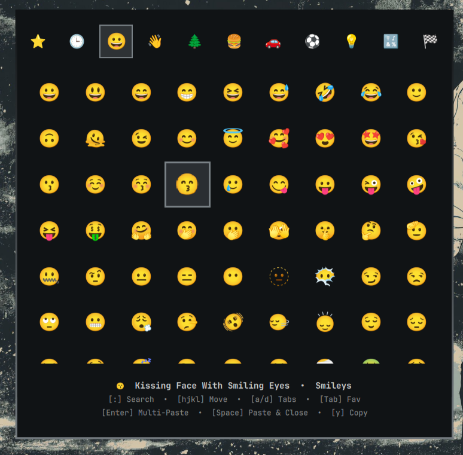

# ✨ Vimoji

> A blazing-fast, modal **Neovim-style emoji picker** for **Omarchy** and **Hyprland** / Wayland desktop environments.

<p align="center">
  
</p>

Vimoji combines modal keyboard ergonomics (`hjkl`, `:`, `a/d`, `Tab`), instant multi-language search (Spanish + English), and seamless zero-delay multi-pasting without closing the window.

---

## 🚀 Features

- ⌨️ **Vim/Neovim Modal Navigation**: Full `hjkl` movement, `a/d` category tabs, `Tab` for favorites, and `:` for command search mode.
- 🔁 **Fluid Multi-Pasting**: Press `Enter` to type the selected emoji repeatedly into your active focused window without closing the menu.
- ⚡ **Instant Paste & Close**: Press `Space` to insert and immediately dismiss the picker.
- 🧠 **Smart Multi-Language & Fuzzy Search**:
  - Search in **Spanish** or **English** (`:corazon`, `:amor`, `:risa`, `:fuego`, `:llorar`, `:fiesta`, `:dog`, `:beer`).
  - **Accent Insensitive**: Type `:musica` or `:música`, `:corazon` or `:corazón`.
  - **Fuzzy Subsequence Matching**: Quick abbreviations like `:sml` find *smile* 😄, `:hr` finds *heart* ❤️.
  - **Relevance Scoring**: Best matches appear under your cursor first.
- 🎯 **Cursor Protection**: Resting mouse pointer does not hijack your keyboard selection during search or category switching.
- 🌟 **Favorites & Recent History**: Preserves recent history and personal favorites across desktop sessions in `~/.local/state/omarchy/`.
- 🎨 **Adaptive Theme Integration**: Uses Omarchy's active theme accent colors with glowing selection borders and smooth animations.

---

## ⌨️ Keybindings Cheat Sheet

### Normal Mode (Default)
| Key | Action |
|---|---|
| `h` / `j` / `k` / `l` (or Arrows) | Move selection (Left / Down / Up / Right) |
| `a` / `d` | Previous / Next Category Tab |
| `:` or `/` | Enter Search Mode |
| `Enter` | **Multi-Paste** emoji into active application (keeps menu open) |
| `Space` | **Paste & Close** immediately |
| `Tab` | Toggle Favorite (⭐) |
| `y` | Copy emoji to clipboard without typing |
| `Esc` | Close picker (or clear search) |

### Search Mode (`:`)
| Key | Action |
|---|---|
| Typing text | Real-time smart / fuzzy search query |
| `Enter` | **Select & Insert** into target text area |
| `Space` | Insert space in search term (e.g. `:face smile`) |
| `Backspace` | Erase character (exits search mode when empty) |
| `Esc` | Return to Normal Mode |

---

## 📦 Installation

### Prerequisites
- **Omarchy** with `quickshell` shell environment
- `wtype` and `wl-copy` (`sudo pacman -S wtype wl-clipboard`)

### Method 1: Official Omarchy Plugin Manager (Recommended)
```bash
omarchy plugin add https://github.com/Zezenta/vimoji.git --enable
```

### Method 2: Manual Clone & Install
```bash
git clone https://github.com/Zezenta/vimoji.git ~/Desktop/Coding/vimoji
cd ~/Desktop/Coding/vimoji
chmod +x install.sh
./install.sh
```

### Keybind Configuration
In your `~/.config/hypr/bindings.conf`:
```ini
bindd = SUPER, period, Emoji picker, exec, omarchy-shell shell toggle zezenta.vimoji
```

Then reload Omarchy shell:
```bash
omarchy-shell shell rescanPlugins && omarchy restart shell
```

---

## 🛠️ Architecture

- **`manifest.json`**: Official Omarchy schemaVersion 1 manifest declaring the `overlay` plugin kind.
- **`Emojis.qml`**: Layer-shell interface with dynamic Wayland keyboard focus negotiation (`WlrLayershell.keyboardFocus`) for zero-delay multi-pasting.
- **`EmojiData.js`**: Unicode 16.0 database (1,906 categorized emojis) + scoring engine & Spanish synonym dictionary.
- **`multi-paste.sh`**: Auxiliary clipboard and input dispatcher using `wtype` and `hyprctl dispatch`.

---

## 📜 License

MIT License. Copyright (c) 2026 [Zezenta](https://github.com/Zezenta).
